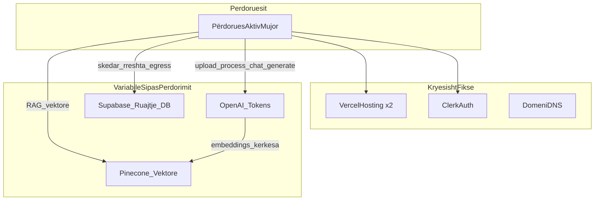

# StudyBuddy — Analiza e Kostove të Infrastrukturës

**Versioni i dokumentit:** 1.0  
**Çmimet sipas datës:** 30 qershor 2026  
**Monedha:** USD  
**Shtrirja:** Stack-u i prodhimit për `app.studybuddy.al` (ky repo) + faqja e marketingut (`studybuddy.al`, projekt i veçantë Vercel)

---

## Përmbledhje ekzekutive

| Gjetje | Detaj |
|--------|-------|
| **Totali më i ulët realist mujor** | ~**$2–3/muaj** me 10 përdorues (kryesisht domeni i amortizuar; të gjitha SaaS në plane falas) |
| **Kostoja variabile dominuese** | **OpenAI** (embeddings + `gpt-4o-mini` për procesim, gjenerim, chat, vision OCR) |
| **Përmirësimi i parë me pagesë i infrastrukturës** | **Supabase Pro (~$25/muaj)** kur ruajtja kumulative e skedarëve tejkalon **1 GB** — me gjasë te **~400 MAU × përdorim mesatar** |
| **Triggeri i dytë i përmirësimit** | **Vercel Pro (~$20/muaj)** nëse kufijtë e compute serverless ose bandwidth shkaktojnë ndalim në përdorim të lartë njëkohës |

Me 10–100 përdorues aktivë mujorë me përdorim të lehtë deri mesatar, produkti mund të funksionojë plotësisht në plane falas, përveç regjistrimit të domenit. Me 1.000 përdorues të regjistruar (~400 MAU mesatar), prisni **~$48–98/muaj** varësisht nga supozimet e aktivitetit.

**Model i redaktueshëm:** [`cost-model.csv`](cost-model.csv)  
**Shablloni i shpenzimeve mujore:** [`cost-reports/README.md`](cost-reports/README.md)

---

## 1. Shtrirja dhe supozimet

### 1.1 Çfarë përfshihet

- Të gjitha shërbimet e palëve të treta të referuara në këtë codebase dhe dokumentet e deploy-it
- Kostot variabile nga ngarkimi i dokumenteve, procesimi RAG, gjenerimi AI dhe chat-i
- Dy profile përdorimi dhe dy korniza numërimi përdoruesish (të regjistruar vs MAU)

### 1.2 Çfarë përjashtohet

- Pagat e zhvilluesve dhe koha e kontraktorëve
- Mjetet e mbështetjes së klientit (asnjë e integruar)
- Monitorimi i gabimeve (Sentry, etj.) — jo në stack
- SaaS për email transaksional (Resend, SendGrid) — Clerk menaxhon email-in e autentifikimit
- Tarifat e planifikuara të faturimit (Lemon Squeezy / Stripe) — dokumentuar në §8 si kosto e ardhshme

### 1.3 Përkufizimet e shkallës së përdoruesve

| Niveli | Përdorues të regjistruar | MAU % e supozuar | MAU bazë | MAU më i keq (të gjithë aktivë) |
|--------|------------------------|------------------|----------|--------------------------------|
| **I vogël** | 10 | 70% | 7 | 10 |
| **Mesatar** | 100 | 50% | 50 | 100 |
| **I madh** | 1.000 | 40% | 400 | 1.000 |

### 1.4 Profilet e përdorimit (për përdorues aktiv në muaj)

| Aktiviteti | I lehtë (konservativ) | Mesatar (përdorues intensiv) |
|------------|----------------------|------------------------------|
| Ngarkime dokumentesh | 2 | 5 |
| Madhësia mesatare e dokumentit | ~2.500 fjalë (~5 faqe) | ~5.000 fjalë (~10 faqe) |
| Gjenerim AI për dokument | 1× përmbledhje, flashcards, kuiz (cache pas herës së parë) | E njëjta |
| Mesazhe chat-i | 10 | 40 |
| Ngarkime OCR imazhi | 0 | 2 |
| Shënime | Minimale | Aktive |

**Referenca kodi:** ndarja në chunks [`src/lib/langchain/splitter.ts`](../src/lib/langchain/splitter.ts) (1000 karaktere, 200 overlap); kufiri i ngarkimit [`src/components/FileUploader.tsx`](../src/components/FileUploader.tsx) (20 MB); RAG top-K [`src/lib/langchain/rag-chain.ts`](../src/lib/langchain/rag-chain.ts).

---

## 2. Arkitektura dhe rrjedha e kostove



**Rrugët e kërkesave që shkaktojnë kosto:**

1. **Ngarkim → Procesim** — [`src/app/api/process/route.ts`](../src/app/api/process/route.ts): shkarkim Supabase → nxjerrje teksti → chunk → embed OpenAI → upsert Pinecone  
2. **Gjenerim** — [`src/app/api/generate/[type]/route.ts`](../src/app/api/generate/[type]/route.ts): marrje Pinecone + `generateObject` (përmbledhje / flashcards / kuiz); rezultatet cache në Supabase  
3. **Chat** — [`src/app/api/chat/route.ts`](../src/app/api/chat/route.ts): marrje Pinecone + streaming `gpt-4o-mini`  
4. **OCR imazhi** — [`src/lib/extractors/image.ts`](../src/lib/extractors/image.ts): vision `gpt-4o-mini` për HEIC/PNG/JPEG  

---

## 3. Regjistri i kostove

| Shërbimi | Roli | Modeli i faturimit | Plani falas (qers 2026) | Kur paguhet | Env vars | Skedarë kyç |
|----------|------|-------------------|-------------------------|-------------|----------|-------------|
| **Vercel** | Host app + marketing | Bandwidth, compute, thirrje | Hobby: 100 GB transfer, 1M thirrje, 4 CPU-orë | Pro $20/muaj + përdorim | Deploy hooks | [`docs/DEPLOYMENT.md`](DEPLOYMENT.md) |
| **Supabase** | Postgres, Storage, Auth legacy | Ruajtje, DB, egress | 500 MB DB, 1 GB ruajtje, 10 GB egress | Pro $25/projekt/muaj | `NEXT_PUBLIC_SUPABASE_*`, `SUPABASE_SERVICE_ROLE_KEY` | [`src/lib/supabase/`](../src/lib/supabase/) |
| **Clerk** | Auth kryesor, webhooks | MRU (Monthly Retained Users) | 50.000 MRU/app (Hobby) | Pro $25/muaj | `NEXT_PUBLIC_CLERK_*`, `CLERK_SECRET_KEY`, `CLERK_WEBHOOK_SIGNING_SECRET` | [`src/proxy.ts`](../src/proxy.ts), [`src/app/api/webhooks/clerk/`](../src/app/api/webhooks/clerk/) |
| **OpenAI** | LLM + embeddings + vision | Për token | Asnjë (pay-as-you-go) | Gjithmonë variabile | `OPENAI_API_KEY` | [`src/app/api/chat/`](../src/app/api/chat/), [`src/lib/langchain/`](../src/lib/langchain/) |
| **Pinecone** | Indeks vektorësh (RAG) | Ruajtje, njësi lexim/shkrim | Starter: 2 GB, 1M lexime, 2M shkrime/muaj | Standard $50/muaj min | `PINECONE_API_KEY`, `PINECONE_INDEX_NAME` | [`src/lib/pinecone.ts`](../src/lib/pinecone.ts) |
| **Google Analytics** | Analitikë faqesh | Evente | Falas në këtë shkallë | — | `NEXT_PUBLIC_GA_MEASUREMENT_ID` | [`src/components/GoogleAnalytics.tsx`](../src/components/GoogleAnalytics.tsx) |
| **GitHub Actions** | Deploy marketing në push | Minuta | Falas për repo të vogla | — | `VERCEL_MARKETING_DEPLOY_HOOK` | [`.github/workflows/deploy-both.yml`](../.github/workflows/deploy-both.yml) |
| **Domeni (.al)** | DNS | Regjistrim vjetor | — | ~$25/vit | — | [`docs/DEPLOYMENT.md`](DEPLOYMENT.md) |

**Burimet e çmimeve:** [OpenAI](https://developers.openai.com/api/docs/pricing) · [Pinecone](https://docs.pinecone.io/guides/manage-cost/understanding-cost) · [Supabase](https://supabase.com/pricing) · [Clerk](https://clerk.com/pricing) · [Vercel](https://vercel.com/docs/plans/hobby)

---

## 4. Ekonomia unitare

### 4.1 Çmimet OpenAI (të përdorura në model)

| Modeli | Input | Output |
|--------|-------|--------|
| `gpt-4o-mini` | $0.15 / 1M token | $0.60 / 1M token |
| `text-embedding-3-small` | $0.02 / 1M token | — |

### 4.2 Vlerësime kostoje për veprim

Të derivuara nga parametrat e codebase-it; kalibroni me një ngarkim real (shih [`cost-reports/README.md`](cost-reports/README.md)).

| Veprimi | Supozime | Kostoja e vlerësuar (USD) |
|---------|----------|---------------------------|
| **Procesim dokumenti (vetëm embed)** | I lehtë: 16 chunks × 250 token | $0.00008 |
| **Pipeline i plotë i dokumentit (herën e parë)** | Embed + 3× generateObject (përmbledhje, flashcards, kuiz) | **~$0.0034** |
| **Mesazh chat-i** | 8 chunks kontekst RAG + histori; ~1.5 kërkesa embed | **~$0.0006** |
| **OCR imazhi** | Vision input ~1.500 + output ~500 token | **~$0.0005** |

Kjo përputhet me kontrollin e README-së “~$0.001 për dokument” për **vetëm embedding** ose përdorim të pjesshëm; **suite e plotë AI herën e parë** është ~3× më e lartë.

### 4.3 Për përdorues aktiv në muaj

| Profili | Formula | OpenAI e vlerësuar / MAU / muaj |
|---------|---------|--------------------------------|
| **I lehtë** | 2 × $0.00337 + 10 × $0.0006 | **$0.013** |
| **Mesatar** | 5 × $0.00345 + 40 × $0.0006 + 2 × $0.00053 | **$0.051** |

### 4.4 Drejtuesit unitarë jashtë OpenAI

| Burimi | Formula |
|--------|---------|
| **Vektorë Pinecone të ruajtur** | Σ (chunks për dokument) për të gjithë përdoruesit; ~16–31 chunks/dok |
| **Lexime Pinecone/muaj** | ~(mesazhe_chat × 2) + (gjenerime × 1) për MAU |
| **Ruajtje Supabase** | MAU × dok/muaj × MB mesatar skedari (kumulative deri sa fshihen) |
| **Egress Supabase** | Çdo procesim shkarkon skedarin nga ruajtja (+ trafik API klienti) |
| **Përdorues të faturueshëm Clerk** | MRU (përdorues që kthehet ≥24 orë pas regjistrimit); zakonisht ≤ MAU |

---

## 5. Matrica e skenarëve (USD mujor)

Vlerat nga [`cost-model.csv`](cost-model.csv). Domeni shfaqet si amortizim mujor ($25/vit ≈ $2.08/muaj).

### 5.1 OpenAI (variabile)

| Skenari | MAU | Profili | OpenAI/muaj |
|---------|-----|---------|-------------|
| I vogël — bazë | 7 | I lehtë | $0.09 |
| I vogël — më i keq | 10 | I lehtë | $0.13 |
| Mesatar — bazë | 50 | I lehtë | $0.64 |
| Mesatar — më i keq | 100 | I lehtë | $1.27 |
| Mesatar — bazë | 50 | Mesatar | $2.56 |
| Mesatar — më i keq | 100 | Mesatar | $5.11 |
| I madh — bazë | 400 | Mesatar | $20.44 |
| I madh — më i keq | 1.000 | Mesatar | $51.10 |
| I madh — bazë | 400 | I lehtë | $5.08 |

### 5.2 Infrastrukturë totale (të gjitha shërbimet)

| Skenari | OpenAI | Pinecone | Supabase | Clerk | Vercel | Domeni | **Totali** |
|---------|--------|----------|----------|-------|--------|--------|------------|
| I vogël — bazë — i lehtë | $0.09 | $0 | $0 | $0 | $0 | $2.08 | **$2.17** |
| I vogël — më i keq — i lehtë | $0.13 | $0 | $0 | $0 | $0 | $2.08 | **$2.21** |
| Mesatar — bazë — i lehtë | $0.64 | $0 | $0 | $0 | $0 | $2.08 | **$2.72** |
| Mesatar — më i keq — i lehtë | $1.27 | $0 | $0 | $0 | $0 | $2.08 | **$3.35** |
| Mesatar — bazë — mesatar | $2.56 | $0 | $0 | $0 | $0 | $2.08 | **$4.64** |
| Mesatar — më i keq — mesatar | $5.11 | $0 | $0 | $0 | $0 | $2.08 | **$7.19** |
| I madh — bazë — mesatar | $20.44 | $0 | $25* | $0 | $0 | $2.08 | **$47.52** |
| I madh — më i keq — mesatar | $51.10 | $0 | $25* | $0 | $20† | $2.08 | **$98.18** |
| I madh — bazë — i lehtë | $5.08 | $0 | $0 | $0 | $0 | $2.08 | **$7.16** |

\* Supabase Pro supozohet kur ruajtja kumulative tejkalon 1 GB planin falas (~400 MAU × mesatar).  
† Vercel Pro supozohet nëse kufijtë Hobby shkaktojnë ndalim në `/api/process` njëkohës (max 60s).

---

## 6. Analiza e kufijve të planit falas

| Shërbimi | Kufiri falas | Mesatar më i keq (100 MAU mesatar) | I madh bazë (400 MAU mesatar) | Statusi |
|----------|--------------|-------------------------------------|-------------------------------|---------|
| **OpenAI** | Pay-as-you-go | ~$5/muaj | ~$20/muaj | Jeshile — shkallëzohet linearisht |
| **Pinecone Starter** | 2 GB, 1M lexime/muaj | ~3K vektorë, ~12K lexime | ~124K vektorë, ~50K lexime | Jeshile |
| **Ruajtje Supabase** | 1 GB | ~0.8 GB kumulative‡ | ~3.2 GB kumulative‡ | E verdhë → **E kuqe** |
| **DB Supabase** | 500 MB | ~50 MB | ~200 MB | Jeshile |
| **Egress Supabase** | 10 GB/muaj | ~5 GB | ~20 GB | Jeshile → E verdhë |
| **Clerk Hobby** | 50K MRU | 100 | 400 | Jeshile |
| **Vercel Hobby** | 100 GB, 1M thirrje | OK | Kufi | E verdhë në shkallë |

‡ Supozon 5 dok × 8 MB mesatar për MAU mesatar, skedarë të mbajtur; varet nga fshirja.

**Çfarë thyhet e para në shkallë:** **ruajtja e skedarëve** Supabase (1 GB), pastaj **egress** (10 GB), pastaj **shpenzimet OpenAI** (pa kufi pa rate limits ose faturim).

---

## 7. Analiza e ndjeshmërisë

±50% në drejtuesit kryesorë (I madh bazë, 400 MAU, profil mesatar):

| Variabla | OpenAI bazë/muaj | −50% | +50% |
|----------|------------------|------|------|
| Mesazhe chat-i (40 → 20/60) | $20.44 | $10.22 | $30.67 |
| Dokumente për MAU (5 → 2.5/7.5) | $20.44 | $10.22 | $30.67 |
| MAU (400 → 200/600) | $20.44 | $10.22 | $30.67 |

**Interpretimi:** Kostot OpenAI shkallëzohen linearisht me përdorimin. Kërcimet e niveleve të infrastrukturës (Supabase Pro, Vercel Pro) janë **funksione hap** — monitoroni ruajtjen dhe kohëzgjatjen e funksioneve veç e veç.

---

## 8. Kostot e ardhshme (jo aktive sot)

Historiku Git referencë stub-e faturimi që ende nuk janë lidhur me prodhimin:

| Artikulli | Kostoja e pritur | Shënime |
|-----------|------------------|---------|
| **Lemon Squeezy / Stripe** | 3–5% + ~$0.30 për transaksion | Merchant-of-record ose procesim pagesash |
| **Clerk Billing** | Përfshirë në planet Clerk | Migrimi `016_clerk_billing.sql` |
| **DB abonimesh** | $0 shtesë | `015_subscriptions.sql` kur deploy-ohet |

**Placeholder pikë e barabartë** (nga modeli i kostos):

```
Përdorues me pagesë të nevojshëm = ceil(kosto_mujore_infra / (çmimi_abonimit × (1 - pct_tarifë_pagese)))
```

Shembull: $47.52/muaj infra ÷ ($9.99 × 0.95) ≈ **5 abonentë me pagesë** te I madh bazë mesatar — përjashton mbështetjen, zhvillimin dhe marzhin e fitimit.

---

## 9. Rekomandime

1. **Vendosni alarme faturimi OpenAI** në $25, $50 dhe $100/muaj para lansimit të marketingut.
2. **Monitoroni panelin Supabase Storage** çdo javë; planifikoni upgrade Pro para 800 MB të përdorura.
3. **Mbani cache-in e gjenerimit** (tashmë i implementuar) — mos rigjeneroni përmbledhje/flashcards/kuiz pa ndryshim përmbajtjeje.
4. **Konsideroni kufij përdorimi** para se faturimi të jetë aktiv (dok/muaj, mesazhe chat/ditë) për të kufizuar OpenAI në skenarin më të keq.
5. **Kalibroni kostot unitare çdo tremujor** duke përdorur procedurën në [`cost-reports/README.md`](cost-reports/README.md).
6. **Qendroni në Pinecone Starter** deri sa të afrohen kufijtë e leximit/shkrimit ose 2 GB ruajtje; shmangni Standard ($50/muaj min) të parakohshëm.
7. **Dokumentoni përdorimin komercial Vercel** — Hobby është për personal/jo-komercial; SaaS prodhimi mund të kërkojë Pro.

---

## 10. Shtojca

### A. Shembull i llogaritur — dokument i lehtë (10 faqe)

1. **Tekst:** ~5.000 fjalë → ~25.000 karaktere  
2. **Chunks:** 25.000 ÷ 800 (hap efektiv) ≈ **31 chunks**  
3. **Kosto embed:** 31 × 250 token × $0.02/1M ≈ **$0.00016**  
4. **Trio gjenerimi:** 3 × (~2.500 in + ~1.200 out token) ≈ **$0.0033**  
5. **Total AI herën e parë:** ≈ **$0.0035** (përputhet me modelin)  
6. **10 mesazhe chat-i:** 10 × $0.0006 ≈ **$0.006**  
7. **Totali i sesionit:** ≈ **$0.01** për ciklin e jetës së dokumentit (pa ruajtjen)

### B. Formula e numërimit të chunks

```
effective_step = chunk_size - chunk_overlap  // 800 karaktere
chunks ≈ ceil(char_count / effective_step)
embed_tokens ≈ chunks × 250
embed_cost_usd = embed_tokens × 0.02 / 1_000_000
```

### C. Variablat e mjedisit (me rëndësi për kosto)

Shih README dhe [`docs/DEPLOYMENT.md`](DEPLOYMENT.md): `OPENAI_API_KEY`, `PINECONE_*`, `SUPABASE_*`, `CLERK_*`, `NEXT_PUBLIC_GA_MEASUREMENT_ID`.

### D. Statusi i kalibrimit

**Statusi i modelit:** Kalibrim teorik nga parametrat e codebase-it (qershor 2026).  
**Rekomandohet:** Kaloni një dokument test në prodhim dhe përditësoni rreshtat UnitCosts në `cost-model.csv` me përdorimin e matur OpenAI (procedura në [`cost-reports/README.md`](cost-reports/README.md)).

### E. Mirëmbajtja e dokumentit

| Detyra | Frekuenca |
|--------|-----------|
| Rifreskim çmimesh furnizuesish | Çdo tremujor |
| Regjistrim shpenzimesh reale | Mujor |
| Rillogaritje skenarësh pas ndryshimeve funksionesh | Për release |
| Rishikim pike e barabartë pas vendosjes së çmimit të abonimit | Para lansimit |

---

*Ky dokument është për planifikim të brendshëm. Shifrat janë vlerësime; faturat reale varen nga sjellja e përdoruesve, retencioni dhe ndryshimet e çmimeve të furnizuesve.*
